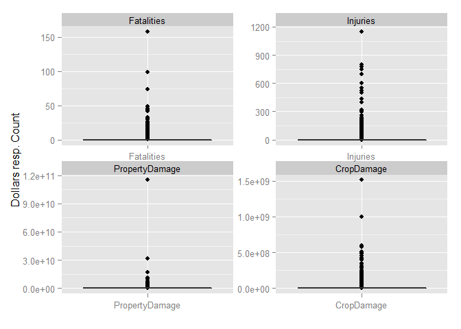
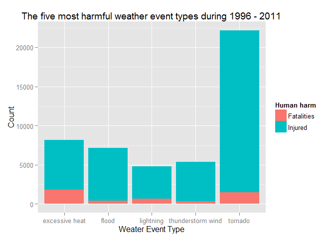
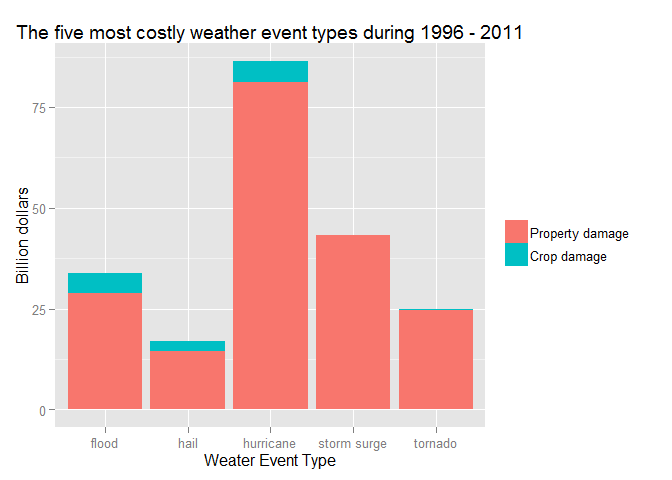

# Hurricans and Tornados are the most severe Weather Events Types in USA
by tomassve  
Sunday, July 27, 2014  

## Synopsis

In this report we aim to answer questions about what types of weather events is 
most harmful with respect to population health and what have the greatest 
economic consequences.

To investigate these questions, we obtained the U.S. National Oceanic and 
Atmospheric Administration's (NOAA) storm database. This database tracks 
characteristics of major storms and weather events in the United States, 
including when and where they occur, as well as estimates of any fatalities, 
injuries, and property damage.

The events in the database start in the year 1950 and end in November 2011. In 
the earlier years of the database there are generally fewer events recorded, 
most likely due to a lack of good records.

Data from 1996 through 2011 were analysed. The most harmful weather type was 
tornado with the respect to totally injured humans but excessive heat caused 
the most casualties. Hurricanes caused the greatest economic consequences.

## Loading and Processing the Raw Data
[Storm Data](https://d396qusza40orc.cloudfront.net/repdata%2Fdata%2FStormData.csv.bz2) 
was downloaded from the Coursera course *Reproducible Research*. Data was read 
into R.

#### Initializations and setup


```r
rm(list=ls())
Sys.setlocale('LC_ALL', 'C')
```

```
## [1] "C"
```

```r
require(dplyr)
```

```
## Loading required package: dplyr
## 
## Attaching package: 'dplyr'
## 
## The following objects are masked from 'package:stats':
## 
##     filter, lag
## 
## The following objects are masked from 'package:base':
## 
##     intersect, setdiff, setequal, union
```

```r
require(lubridate)
```

```
## Loading required package: lubridate
```

```r
require(ggplot2)
```

```
## Loading required package: ggplot2
```

```r
require(reshape2)
```

```
## Loading required package: reshape2
```

### Reading in the data

```r
toRead <- c("NULL", "character", rep("NULL", 4), "NULL", "character", 
             rep("NULL", 14), "numeric", "numeric", "numeric", "character", 
             "numeric", "character", rep("NULL", 3), "NULL", "NULL", 
             rep("NULL", 4))

stormData <- read.csv(bzfile("repdata-data-StormData.csv.bz2"), 
                      colClasses = toRead, nrows = -1)
stormData <- tbl_df( stormData )
```

### Data Processing
After data was read into R, it was preprocessed. During the preprocessing 
variable names was cleaned, irrelevant data was filter out, the *weather 
event type* (evtype) was cleaned, new variables were derived and last outliers
were searched and removed.

#### Preprocessing

##### Cleaning of variable names

```r
colnames(stormData) <- gsub('_', '.',tolower(colnames(stormData)))
```

##### Pre-filtering of data
Appropriate data set was selected before cleaning to reduce processing time.

```r
stormData$bgn.date <- as.POSIXct(stormData$bgn.date,format="%m/%d/%Y %H:%M:%S")
```

###### Omitting data before 1996
[National Climatic Data Center | Storm Events Database](http://www.ncdc.noaa.gov/stormevents/details.jsp?type=eventtype) 
describes that from 1996 to present, 48 event types are recorded as defined in 
NWS Directive 10-1605. All data prior to 1996 were removed, since it may be incomplete and of lower quality. Including the discarded data after careful 
cleaning could bring valuable information to rare events lost by the shorter
time span in this 
analysis.


```r
stormData <- filter(stormData, year(bgn.date) >= 1996)
```

###### Omitting data without any fatalities, injuries or costs
This analysis focus on total harm or cost and not the average. Data without any 
fatalities, injuries or costs were removed to easy the cleaning of evtype.


```r
stormData <- filter(stormData, (fatalities != 0) | (injuries != 0) | 
                        (propdmg != 0) | (cropdmg != 0) )
```

##### Cleaning Weather Event Type (evtype)
This variable ought to be on out of 48 categories. Spelling errors/variations and 
the use of multiple categories leads to that there are many more than 48. This 
variable has been cleared iteratively by analysis of the top 25 harmful and costly 
weather event type for duplicates.

###### Triming white space and lowering case evtype

```r
clean.evtype <- tolower(stormData$evtype)
clean.evtype<-gsub("^\\s+|\\s+$", "", clean.evtype)
clean.evtype<-gsub("\\s+", " ", clean.evtype)
```

###### Correct alternative spelling in evtype

```r
clean.evtype <- gsub("winds", "wind", clean.evtype)
clean.evtype <- gsub("tstm", "thunderstorm", clean.evtype)
clean.evtype <- gsub("flooding", "flood", clean.evtype)
clean.evtype <- gsub("currents", "current", clean.evtype)
```

###### Reduce multiple categories to a single one
Multiple categories were reduced to a single one by assigning to the most 
harmful or costly. 


```r
clean.evtype <- gsub("flood/flash flood", "flash flood", clean.evtype)
clean.evtype <- gsub("flash flood/flood", "flash flood", clean.evtype)

clean.evtype <- gsub("extreme cold/wind chill", "extreme cold", clean.evtype)
clean.evtype <- gsub("hurricane/typhoon", "hurricane", clean.evtype)

allEvtypes <- sort(unique(clean.evtype))
length(allEvtypes)
```

```
## [1] 168
```
There remained 168 weather event types after cleaning.

##### Deriving variables
###### Cost
Cost in dollars instead of multiples of dollar was computed. Multiplies were 
decoded. Other multiple code than '0123456789hHkKmMbB', e.g. +, -, ? and empty 
string, was treated as zero.


```r
stormData <- mutate(stormData, d.evtype = clean.evtype)
rm("clean.evtype")
exp2exponent <- function(exp) {
    tr <- chartr(
        'hHkKmMbB',
        '22336699', exp)
    res<-10^as.numeric( tr )
    res[is.na(res)] <- 0
    res
    }
stormData <- mutate(stormData, d.propdmg = (propdmg*exp2exponent(propdmgexp)))
stormData <- mutate(stormData, d.cropdmg = (cropdmg*exp2exponent(cropdmgexp)))
stormData <- mutate(stormData, d.cost = d.propdmg+d.cropdmg)
```

###### Human harm
The sum of the number fatalities and injuries was calculated as a composed measure 
of harm.

```r
stormData <- mutate(stormData, d.harm = fatalities+injuries)
```

##### Check data
###### Evtype cleaned sufficiently
Data was summarised and sorted in descending for harm respectively cost. The 25 
most harmful and most costly evtypes were analysed for possible duplicates. When
found the preprocessing code was updated. 

No duplicates were found in the table below and no further cleaning of evtype 
was needed. 

```r
sum.stormData <- summarise(group_by(stormData,d.evtype), 
                           sum.harm       = sum(d.harm),
                           sum.fatalities = sum(fatalities),
                           sum.injuries   = sum(injuries),
                           sum.cost       = sum(d.cost),
                           sum.propdmg    = sum(d.propdmg),
                           sum.cropdmg    = sum(d.cropdmg)
                           )
cbind(arrange(sum.stormData, desc(sum.harm))$d.evtype, 
      arrange(sum.stormData, desc(sum.cost))$d.evtype)[1:25,]
```

```
##       [,1]                [,2]               
##  [1,] "tornado"           "flood"            
##  [2,] "excessive heat"    "hurricane"        
##  [3,] "flood"             "storm surge"      
##  [4,] "thunderstorm wind" "tornado"          
##  [5,] "lightning"         "hail"             
##  [6,] "flash flood"       "flash flood"      
##  [7,] "winter storm"      "drought"          
##  [8,] "heat"              "thunderstorm wind"
##  [9,] "hurricane"         "tropical storm"   
## [10,] "high wind"         "high wind"        
## [11,] "rip current"       "wildfire"         
## [12,] "wildfire"          "storm surge/tide" 
## [13,] "heavy snow"        "ice storm"        
## [14,] "fog"               "wild/forest fire" 
## [15,] "hail"              "winter storm"     
## [16,] "wild/forest fire"  "extreme cold"     
## [17,] "blizzard"          "heavy rain"       
## [18,] "strong wind"       "frost/freeze"     
## [19,] "ice storm"         "lightning"        
## [20,] "tropical storm"    "heavy snow"       
## [21,] "dust storm"        "typhoon"          
## [22,] "avalanche"         "blizzard"         
## [23,] "winter weather"    "excessive heat"   
## [24,] "extreme cold"      "coastal flood"    
## [25,] "heavy rain"        "landslide"
```

###### Check for outliers and NAs

```r
tmp<-select(stormData, d.evtype, Fatalities=fatalities, Injuries=injuries, 
            PropertyDamage=d.propdmg, CropDamage=d.cropdmg)
tmp<-melt( tmp, "d.evtype", 
           c("Fatalities", "Injuries", "PropertyDamage", "CropDamage"))
ggplot(tmp, aes(x=variable, y=value)) + 
    geom_boxplot() + facet_wrap(~ variable, ncol = 2, scales="free") +
    labs(x = "", y = "Dollars resp. Count")
```

 

In the lower left box-plot above a suspicious large property damage value is found. 

Below there is a  single large value of the weather event type "flood". It is 
mostly an human input error since its is about 40 times larger than the second 
largest flood damage. 


```r
arrange(filter(select(stormData, contains("^d[.]")), d.evtype == "flood"), 
        desc(d.propdmg))[1:5,]
```

```
## Source: local data frame [5 x 5]
## 
##   d.evtype d.propdmg d.cropdmg   d.cost d.harm
## 1    flood  1.15e+11  32500000 1.15e+11      0
## 2    flood  3.00e+09         0 3.00e+09      0
## 3    flood  2.00e+09         0 2.00e+09      0
## 4    flood  1.50e+09      1000 1.50e+09     10
## 5    flood  1.00e+09         0 1.00e+09      0
```
For this reason the sample was omitted in the further analysis.

```r
stormData <- filter(stormData, d.propdmg < 1E11)
sum.stormData <- summarise(group_by(stormData,d.evtype), 
                           sum.harm       = sum(d.harm),
                           sum.fatalities = sum(fatalities),
                           sum.injuries   = sum(injuries),
                           sum.cost       = sum(d.cost),
                           sum.propdmg    = sum(d.propdmg),
                           sum.cropdmg    = sum(d.cropdmg)
                           )
```

There are no NAs.

```r
sum(is.na(tmp$value))
```

```
## [1] 0
```

```r
rm(tmp)
```


## Results

### Events most harmful to population health
The figure below shows the five weather event types causing most harm to humans. 
The most harmful is *tornados* followed by *excessive heat*, *flood*, 
*thunderstorm wind* and last *lightning*. Regarding fatalities the *excessive heat* 
is the worst.

```r
nEvents <- 5
harmful <- melt( arrange(sum.stormData, desc(sum.harm))[1:nEvents,], "d.evtype", 
                 c("sum.fatalities", "sum.injuries"))
ggplot(harmful, aes(d.evtype, value, fill = variable)) +
    geom_bar( postion = "dodge", stat = "identity" ) + 
    guides(fill = guide_legend(title = "Human harm")) +
    scale_fill_discrete(labels = c("Fatalities", "Injured")) +
    labs(x = "Weater Event Type", y = "Count") + 
    ggtitle("The five most harmful weather event types during 1996 - 2011")
```

 


### Events having the greatest economic consequences
The figure below shows the five most costly weather event types. Most 
costly is *hurricanes* follow by *storm surge*, *flood*, *tornado* and last *hail*. 
It can be noted that *flood* moved from being the worst to being the third worst 
by removing the above identified outlier.


```r
nEvents <- 5
costly <- melt( arrange(sum.stormData, desc(sum.cost))[1:nEvents,], "d.evtype", 
                 c("sum.propdmg", "sum.cropdmg"))
ggplot(costly, aes(d.evtype, value/1E9, fill = variable)) +
    geom_bar( postion = "dodge", stat = "identity" ) + 
    guides(fill = guide_legend(title = "")) +
    scale_fill_discrete(labels = c("Property damage", "Crop damage")) +
    labs(x = "Weater Event Type", y = "Billion dollars") + 
    ggtitle("The five most costly weather event types during 1996 - 2011")
```

 
